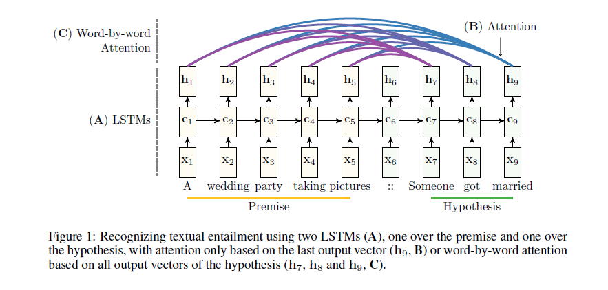
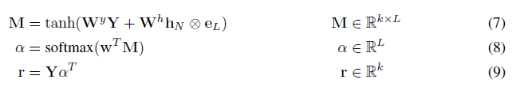
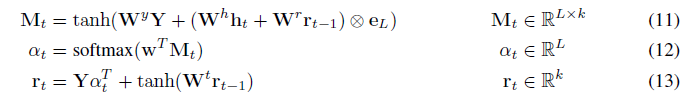

# Text Matching Based on Attention Mechanism

Based on [Pytorch](https://github.com/pytorch/pytorch) and [TorchText](https://github.com/pytorch/text)
- [Dataset](https://nlp.stanford.edu/projects/snli/) `SNLI` 
  
    > The `SNLI `corpus (version 1.0) is a collection of 570k human-written English sentence pairs manually labeled for balanced classification with the labels entailment, contradiction, and neutral, supporting the task of natural language inference (NLI), also known as recognizing textual entailment (RTE). We aim for it to serve both as a benchmark for evaluating representational systems for text, especially including those induced by representation learning methods, as well as a resource for developing NLP models of any kind.
- [Word Emebedding](https://nlp.stanford.edu/projects/glove/) 

## Concepts

-   Recognizing textual entailment (RTE)

-   判断两个文本序列premise和hypothesis之间的是否存在蕴含关系，是一个分类问题。（蕴含/矛盾/无关）
    -   contradicting each other
    -   not related
    -   the first sentence (called premise) entails the second sentence (called
        hypothesis).
-   这个任务很重要，因为许多自然语言处理问题，如信息提取、关系提取、文本摘要或机器翻译，都依赖于它，并且可以从更精确的RTE系统中获益

## Paper

- [Reasoning about Entailment with Neural Attention](https://arxiv.org/abs/1509.06664)  

    - 摘要: 自动识别自然语言句子对之间的隐含关系，一直是利用人工工程特征的分类器的优势。直到最近，端到端可微神经结构还没有达到最先进的性能。在本文中，我们提出了一个神经模型，使用长短时记忆单元读取两个句子从而确定蕴含关系。我们通过一个逐字的神经注意机制来扩展这个模型，该机制鼓励对的单词对和短语对进行推理。此外，我们对该模型产生的注意权重进行了定性分析，证明了这种推理能力。在一个大数据集上，该模型比之前的最佳神经模型和具有工程特征的分类器有很大的优势。它是第一个通用的端到端可微系统，实现了对文本数据集的最先进的准确性。
- 介绍
  
    -   RTE的端到端
    -   可微解决方案是可取的，因为它避免了对底层语言的特定假设。特别是，不需要像词性标记或依赖解析这样的语言特性。此外，一个通用的seq2seq解决方案允许跨任何序列数据，扩展捕获蕴含的概念，而不仅仅是自然语言。
      -   Bowman等人的LSTM将前提和假设编码为密集的定长向量，然后将其串联在多层感知器(MLP)中进行分类。这表明LSTM可以学习语义丰富的句子表示，这些句子表示适合于确定文本的蕴涵。相比之下，我们提出了一种专注的神经网络，它能够通过处理前提条件下的假设，对成对的单词和短语进行推理。
          -   贡献 Seq2Seq + Attention
              -   我们提出了一个基于LSTM的神经模型，它可以一次读取两个语句来确定蕴涵关系。而不是将每个句子单独映射到一个语义空间。
                  -   我们通过一个word-by-word的注意机制来扩展这个模型，以鼓励对成对单词和短语进行推理
                      -   我们为RTE提供了一个详细的神经注意定性分析。
    
- 模型
    
    -   与学习句子表示不同的是，我们感兴趣的是神经模型，它能读懂两个句子来确定句子之间的关联，从而推断出成对的单词和短语之间的关联。
    
        -   模型架构图
    
        -   LSTM分别read前提与假设，并且read假设的LSTM的cell state初始化为前一LSTM的last cell state，并且读入一个定界符。
            -   使用Word2Vec并且不对其进行优化。OOV的单词初始化为(-0.05,0.05)的均匀分布并且在训练中进行优化。将val与test时的OOV单词设置为固定的随机向量。
                -   将最后一个hidden state经过非线性激活后，使用softmax进行多分类(ENAILMENT, NEUTRAL or CONTRADICTION)，损失函数为交叉熵。
                    -   使用attention机制，使模型不受cell state的瓶颈限制
                                    - 
                                    - $\mathbf{Y} \in \mathbb{R}^{k \times L}$ 是由第一个LSTM读取了长度为L的前提后的输出向量$\left[\mathbf{h}_{1} \cdots \mathbf{h}_{L}\right]$
                                    - k是embeddings和hidden layers的维数
                                    - 最终用于分类的表示为$\mathbf{h}^{*}=\tanh \left(\mathbf{W}^{p} \mathbf{r}+\mathbf{W}^{x} \mathbf{h}_{N}\right) \quad \mathbf{h}^{*} \in \mathbb{R}^{k}$
                                - 它一次读取两个句子来确定两个句子之间的蕴含关系，而不是将每个句子独立映射到一个语义空间。我们引入逐字的（word-by-word）Attention Mechanism来扩展这个模型，来强化模型对单词或短语对的关系推理能力。
                                    - 通过在前提和假设中对单词和短语进行软对齐，获得句子对编码。在我们的例子中，这相当于在第二个LSTM每次处理一个单词时都关注第一个LSTM的输出向量，从而为假设中的每个单词生成注意权重
                                    - 
                                    - 最终用于分类的表示为$\mathbf{h}^{*}=\tanh \left(\mathbf{W}^{p} \mathbf{r}_{L}+\mathbf{W}^{x} \mathbf{h}_{N}\right) \quad \mathbf{h}^{*} \in \mathbb{R}^{k}$
                                - Two-way Attention: 将前提与假设对调 生成的两个表示concatenate后分类
    
            - 模型架构图
                - LSTM分别read前提与假设，并且read假设的LSTM的cell state初始化为前一LSTM的last cell state，并且读入一个定界符。
                - 使用Word2Vec并且不对其进行优化。OOV的单词初始化为(-0.05,0.05)的均匀分布并且在训练中进行优化。将val与test时的OOV单词设置为固定的随机向量。
                - 将最后一个hidden state经过非线性激活后，使用softmax进行多分类(ENTAILMENT, NEUTRAL or CONTRADICTION)，损失函数为交叉熵。
                - 使用attention机制，使模型不受cell state的瓶颈限制
                    - 
                    - $\mathbf{Y} \in \mathbb{R}^{k \times L}$ 是由第一个LSTM读取了长度为L的前提后的输出向量$\left[\mathbf{h}_{1} \cdots \mathbf{h}_{L}\right]$
                    - k是embeddings和hidden layers的维数
                    - 最终用于分类的表示为$\mathbf{h}^{*}=\tanh \left(\mathbf{W}^{p} \mathbf{r}+\mathbf{W}^{x} \mathbf{h}_{N}\right) \quad \mathbf{h}^{*} \in \mathbb{R}^{k}$
                - 它一次读取两个句子来确定两个句子之间的蕴含关系，而不是将每个句子独立映射到一个语义空间。我们引入逐字的（word-by-word）Attention Mechanism来扩展这个模型，来强化模型对单词或短语对的关系推理能力。
                    - 通过在前提和假设中对单词和短语进行软对齐，获得句子对编码。在我们的例子中，这相当于在第二个LSTM每次处理一个单词时都关注第一个LSTM的输出向量，从而为假设中的每个单词生成注意权重
                    - 
                    - 最终用于分类的表示为$\mathbf{h}^{*}=\tanh \left(\mathbf{W}^{p} \mathbf{r}_{L}+\mathbf{W}^{x} \mathbf{h}_{N}\right) \quad \mathbf{h}^{*} \in \mathbb{R}^{k}$
                - Two-way Attention: 将前提与假设对调 生成的两个表示concatenate后分类
    
- [Enhanced LSTM for Natural Language Inference](https://arxiv.org/abs/1609.06038v3)
- 摘要: 与之前使用非常复杂的网络体系结构的顶级模型不同，我们首先证明了基于链LSTMs的顺序推理模型的精心设计可以优于所有之前的模型。在此基础上，我们进一步表明，通过在局部推理建模和推理组合中显式地考虑递归体系结构，我们实现了额外的改进。特别是，合并语法解析信息有助于获得最佳结果—即使添加到已经非常强大的模型中，它也会进一步提高性能。

## Reference

- https://blog.csdn.net/xiayto/article/details/81247461

## Others

-   every model has `.ipynb` and `.py ` because `.py` is better for debug and `.ipynb` has better interactions