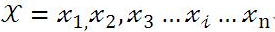
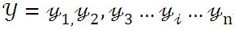
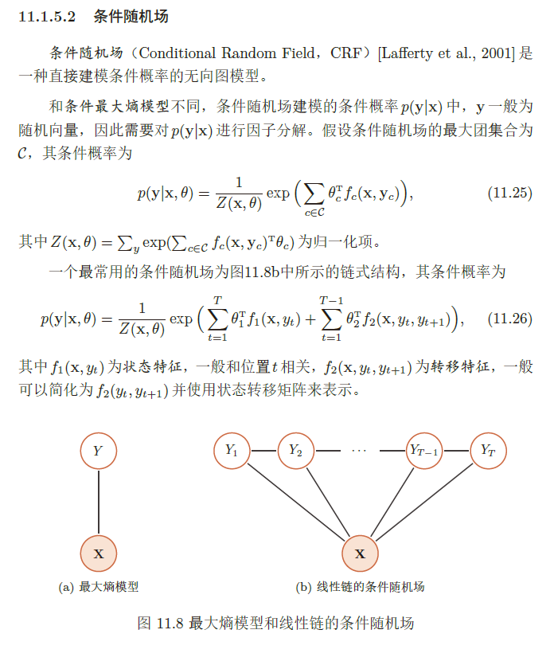
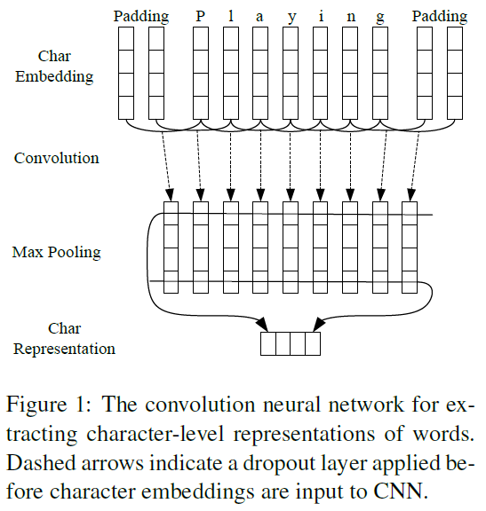
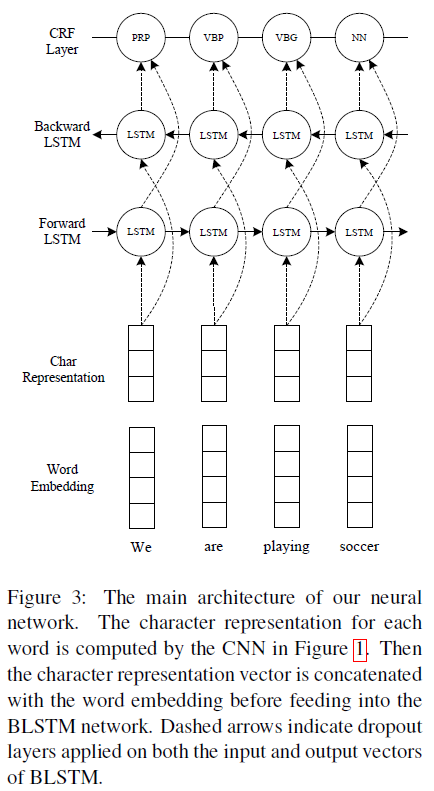

# Sequence Annotation Based on LSTM+CRF
Based on [Pytorch](https://github.com/pytorch/pytorch)
- [Dataset](https://www.clips.uantwerpen.be/conll2003/ner/)
    - Concentrate on four types of named entities: persons, locations, organizations and names of miscellaneous entities that do not belong to the previous three groups.
        - PER LOC ORG MISC
    - Each word has been put on a separate line and there is an empty line after each sentence. The first item on each line is a word, the second a part-of-speech (POS) tag, the third a syntactic chunk tag and the fourth the named entity tag. The chunk tags and the named entity tags have the format I-TYPE which means that the word is inside a phrase of type TYPE. Only if two phrases of the same type immediately follow each other, the first word of the second phrase will have tag B-TYPE to show that it starts a new phrase. A word with tag O is not part of a phrase. Here is an example:
    
```
  Word				 POS	SynC	NE
  U.N.         NNP  I-NP  I-ORG 
  official     NN   I-NP  O 
  Ekeus        NNP  I-NP  I-PER 
  heads        VBZ  I-VP  O 
  for          IN   I-PP  O 
  Baghdad      NNP  I-NP  I-LOC 
  .            .    O     O 
```

- [Word Emebedding](https://nlp.stanford.edu/projects/glove/) 

## Concepts
### 序列标注

序列标注问题包括自然语言处理中的分词，词性标注，命名实体识别，关键词抽取，词义角色标注等等。我们只要在做序列标注时给定特定的标签集合，就可以进行序列标注。

序列标注问题是NLP中最常见的问题，因为绝大多数NLP问题都可以转化为序列标注问题，虽然很多NLP任务看上去大不相同，但是如果转化为序列标注问题后其实面临的都是同一个问题。所谓“序列标注”，就是说对于一个一维线性输入序列：



给线性序列中的每个元素打上标签集合中的某个标签：



所以，其本质上是对线性序列中每个元素根据上下文内容进行分类的问题。一般情况下，对于NLP任务来说，线性序列就是输入的文本，往往可以把一个token(level不定)看做线性序列的一个元素，而不同任务其标签集合代表的含义可能不太相同，但是相同的问题都是：如何根据token的上下文给token打上一个合适的标签（无论是分词，还是词性标注，或者是命名实体识别，道理都是相通的）

### 评价指标

`F1 score` 是`NMT`领域的常用指标

-   预测结果和答案之间的平均单词重叠 `the average word overlap`
-   预测结果和答案被处理为符号级别，符号级别的`F1 score`计算公式如下：

$$
F1 = \frac{2 * Precision * Recall}{Precision + Recall}
$$

$$
Precision = \frac{TP}{TP+FP} // 预测为正的样本的正确率 查准率
$$

$$
Recall = \frac{TP}{TP+FN} // 正样本的中预测正确的部分
$$

-   为了让评估更加可靠，我们会对每个问题给出多个标准答案，因此EM中只要和一个标准答案一致即可，F1则是计算预测结果和所有标准答案的最大得分

### CRF

#### CRF和LSTM在序列标注上的优劣



　　**LSTM：**像RNN、LSTM、BILSTM这些模型，它们在序列建模上很强大，它们能够capture长远的上下文信息，此外还具备神经网络拟合非线性的能力，这些都是crf无法超越的地方，对于t时刻来说，输出层yt受到隐层ht（包含上下文信息）和输入层xt（当前的输入）的影响，但是yt和其他时刻的yt‘是相互独立的，感觉像是一种point wise，对当前t时刻来说，我们希望找到一个概率最大的yt，但其他时刻的yt’ 对当前yt没有影响，**如果yt之间存在较强的依赖关系的话**（例如，形容词后面一般接名词，存在一定的约束），LSTM无法对这些约束进行建模，LSTM模型的性能将受到限制。

　　**CRF：**它不像LSTM等模型，能够考虑长远的上下文信息，**它更多考虑的是整个句子的局部特征的线性加权组合（通过特征模版去扫描整个句子）**。关键的一点是，CRF的模型为p(y | x, w)，注意这里y和x都是序列，它有点像list wise，优化的是一个序列y = (y1, y2, …, yn)，而不是某个时刻的yt，即找到一个概率最高的序列y = (y1, y2, …, yn)使得p(y1, y2, …, yn| x, w)最高，它计算的是一种联合概率，优化的是整个序列（最终目标），而不是将每个时刻的最优拼接起来，在这一点上CRF要优于LSTM。

　　**HMM：**CRF不管是在实践还是理论上都要优于HMM，HMM模型的参数主要是“初始的状态分布”，“状态之间的概率转移矩阵”，“状态到观测的概率转移矩阵”，这些信息在CRF中都可以有，例如：在特征模版中考虑h(y1), f(yi-1, yi), g(yi, xi)等特征。

　　**CRF与LSTM：**从数据规模来说，在数据规模较小时，CRF的试验效果要略优于BILSTM，当数据规模较大时，BILSTM的效果应该会超过CRF。从场景来说，如果需要识别的任务不需要太依赖长久的信息，此时RNN等模型只会增加额外的复杂度，此时可以考虑类似科大讯飞**FSMN**（一种基于窗口考虑上下文信息的“前馈”网络）。

　　**CNN＋BILSTM＋CRF：**这是目前学术界比较流行的做法，BILSTM＋CRF是为了结合以上两个模型的优点，CNN主要是处理英文的情况，英文单词是由更细粒度的字母组成，这些字母潜藏着一些特征（例如：前缀后缀特征），通过CNN的卷积操作提取这些特征，在中文中可能并不适用（中文单字无法分解，除非是基于分词后），这里简单举一个例子，例如词性标注场景，单词football与basketball被标为名词的概率较高， 这里后缀ball就是类似这种特征。

## Paper

>   第一篇论文中，作者并未详细介绍CRF在模型中的计算流程，其在github上发布的repo中做出来详细介绍

### [End-to-end Sequence Labeling via Bi-directional LSTM-CNNs-CRF](https://arxiv.org/abs/1603.01354)  

#### 摘要

最先进的序列标记系统通常以手工制作的特征和数据预处理的形式引入大量的任务特定的知识。本文介绍了一种利用双向LSTM与CNN和CRF相结合的新型网络结构，该结构能自动地从字级和字级表示中获益。我们的系统是真正的端到端的，不需要任何特征工程或数据预处理，因此适用于大范围的序列任务。该模型在PennTreebank WSJ词性标注任务和CoNLL 2003 词性标注数据集上取得优异的成绩，前者97.55%的准确率，后者取得91.21%的F1值。

#### 简介

-   大部分传统的高效模型是线性统计模型，包括HMM，CRF等。传统序列标注模型存在的问题：
    -   大多数是基于线性的统计语言模型
    -   基于大量的人工特征
    -   需要大量的外部数据，比如名称库
    -   普适性差
-   上述问题导致其难以适用到新的任务/领域
-   近些年有一些非线性神经网络模型用词向量（Word Embedding）作为输入，颇为成功。有前馈神经网络、循环神经网络（RNN）、长短期记忆模型（LSTM）、GRU，取得了很有竞争力的结果。
    -   它们把词向量用来增强而不是取代原来的手工特征
    -   另一方面，如果这些模型完全依赖于神经嵌入，那么性能下降非常快
-   本文贡献
    -   一种用于语言序列标记的新型神经网络架构
    -   两个经典NLP任务的基准数据集的经验评估
    -   最先进的性能与真正的端到端系统
        -   没有任务特定的资源
        -   没有特征工程
        -   除却预先训练的单词嵌入，没有在未标记的语料库上的数据预处理

#### 网络结构

##### CNN for Character-level Representation

CNN的优点是可以高效地学习形态学特征，比如单词的前缀或者后缀、大小写等



-   只使用字符嵌入作为CNN的输入，没有字符类型特性
-   字符嵌入输入CNN前经过一层Dropout层

##### Bi-directional LSTM

-   把CNN获得的单词表示和事先训练好的词向量拼接起来，输入BiLSTM得到每个状态的表示。

-   BiLSTM的输入和输出都使用Dropout层

##### CRF

将BiLSTM的输出向量作为CRF层的输入，最终预测出序列

用 $\mathbf{Z}=\left\{\mathbf{z}_{1}, \cdots, \mathbf{z}_{n}\right\}$ 代表通用输入序列， $ z_i $是$i$th词的输入向量. $y=\left\{y_{1}, \cdots, y_{n}\right\}$代表 $z$ 的标签.
$\mathcal{Y}(\mathbf{z})$ 表示 $z$ 的可能标签集合。序列CRF的概率模型对于所有的给定 $\boldsymbol z$ 的标签序列$\boldsymbol y$ 定义了一类条件概率 $p(\boldsymbol{y} | \mathbf{z} ; \mathbf{W}, \mathbf{b})$

$$
p(\boldsymbol{y} | \mathbf{z} ; \mathbf{W}, \mathbf{b})=\frac{\prod_{i=1}^{n} \psi_{i}\left(y_{i-1}, y_{i}, \mathbf{z}\right)}{\sum_{y^{\prime} \in \mathcal{Y}(\mathbf{z})} \prod_{i=1}^{n} \psi_{i}\left(y_{i-1}^{\prime}, y_{i}^{\prime}, \mathbf{z}\right)}
$$
$\psi_{i}\left(y^{\prime}, y, \mathbf{z}\right)=\exp \left(\mathbf{W}_{y^{\prime}, y}^{T} \mathbf{z}_{i}+\mathbf{b}_{y^{\prime}, y}\right)$ 是可能性函数，$\mathbf{W}_{y^{\prime}, y}^{T}$ 和$\mathbf{b}_{y^{\prime}, y}$分别是为标签对$\left(y^{\prime}, y\right)$对应的权向量和偏置

Loss使用最大条件似然估计，对于训练集$\left\{\left(\mathbf{z}_{i}, \boldsymbol{y}_{i}\right)\right\}$
$$
L(\mathbf{W}, \mathbf{b})=\sum_{i} \log p(\boldsymbol{y} | \mathbf{z} ; \mathbf{W}, \mathbf{b})
$$
搜索条件概率最高的标签序列$y^{*}$
$$
y^{*}=\underset{y \in \mathcal{Y}(\mathbf{z})}{\operatorname{argmax}} p(\boldsymbol{y} | \mathbf{z} ; \mathbf{W}, \mathbf{b})
$$
对于一个序列CRF模型(只考虑两个连续标签之间的交互作用)，采用`Viterbi`算法可以有效地解决训练和解码问题。

$$ \begin{align*} C(y_1, \ldots, y_m) &= b[y_1] &+ \sum_{t=1}^{m} s_t [y_t] &+ \sum_{t=1}^{m-1} T[y_{t}, y_{t+1}] &+ e[y_m] \\ &= \text{begin} &+ \text{scores} &+ \text{transitions} &+ \text{end} \end{align*}$$

##### BLSTM-CNNs-CRF



对于每个单词，CNN用字符嵌入作为输入计算字符级表示。然后，将字符级表示向量与单词嵌入向量连接起来，以提供给BiLSTM网络。最后，将BiLSTM的输出向量输入CRF层，共同解码出最佳标签序列。BiLSTM的输入和输出都使用Dropout层。

#### 实验设置

Word Embedding 使用 `Glove`

Character Embedding 初始化为 $\left[-\sqrt{\frac{3}{\operatorname{dim}}},+\sqrt{\frac{3}{\operatorname{dim}}}\right]$ 的 均匀分布，dim = 30

Weight Matrix初始化为$\left[-\sqrt{\frac{6}{r+c}},+\sqrt{\frac{6}{r+c}}\right]$ 的均匀分布，$r,c$分别代表其行数和列数

Bias 初始化为0，但LSTM中的遗忘门的$b_f$ 初始化为1

使用了SGD优化，梯度衰减和梯度裁剪(基于范数)，使用Early Stop和Dropout(CNN输入、LSTM的输入和输出)，并对所有自初始化的Embedding进行微调

#### 总结

本文提出了一种用于序列标记的神经网络结构。它是一个真正的端到端模型，不依赖于特定于任务的资源、特性工程或数据预处理。与之前最先进的系统相比，我们在两个语言序列标记任务上取得了最先进的性能。

未来的工作有几个潜在的方向。首先，我们的模型可以进一步改进，探索多任务学习方法，结合更多有用和相关的信息。例如，我们可以用POS和NER标签共同训练一个神经网络模型来改进我们在网络中学习到的中间表示。另一个有趣的方向是将我们的模型应用于其他领域的数据，如社交媒体(Twitter和微博)。由于我们的模型不需要任何特定于领域或任务的知识，所以可能很容易将它应用到这些领域

#### Details

##### linear-chain CRF

-   softmax makes local choices. In other words, even if we capture some information from the context thanks to the bi-LSTM, the tagging decision is **still local.** We don’t make use of the neighboring tagging decisions. Given a sequence of words $w_1,…,w_m$, a sequence of score vectors $s_1,…,s_m$ and a sequence of tags $y_1,…,y_m$, a linear-chain CRF defines a global score $C \in \mathbb{R}$ such that

$$
\begin{align*}
C(y_1, \ldots, y_m) &= b[y_1] &+ \sum_{t=1}^{m} s_t [y_t] &+ \sum_{t=1}^{m-1} T[y_{t}, y_{t+1}] &+ e[y_m]\\
                    &= \text{begin} &+ \text{scores} &+ \text{transitions} &+ \text{end}
\end{align*} 
$$

-   where $T$ is a transition matrix in $R^{9×9}$ and $e,b \in R^9$ are vectors of scores that capture the cost of beginning or ending with a given tag. The use of the matrix $T$ captures linear (one step) dependencies between tagging decisions.
-   The motivation behind CRFs was to generate **sentence level** likelihoods for optimal tags. What that means is for each word we estimate maximum likelihood and then we use the `Viterbi `algorithm to decode the tag sequence optimally.
-   Softmax doesn't value any dependencies, this is a problem since NER the context heavily influences the tag that is assigned. This is solved by applying CRF as it takes into account the full sequence to assign the tag.

##### Evaluation schemes

Forward pass and `Viterbi `algorithm

-   Recall that the CRF computes a conditional probability. Let $y$ be a tag sequence and $x$ an input sequence of words. Then we compute

$$
P(y|x) = \frac{\exp{(\text{Score}(x, y)})}{\sum_{y'} \exp{(\text{Score}(x, y')})}
$$

-   Where the score is determined by defining some log potentials $\log \psi_i(x,y)$ such that

$$
\text{Score}(x,y) = \sum_i \log \psi_i(x,y)
$$

-   In our model, we define two kinds of potentials: emission and transition. The emission potential for the word at index $i$ comes from the hidden state of the Bi-LSTM at timestep $i$. The transition scores are stored in a $|T|x|T|$ matrix $P$, where $T$ is the tag set. In my implementation, $P_{j,k}$ is the score of transitioning to tag $j$ from tag $k$. So:

$$\text{Score}(x,y) = \sum_i \log \psi_\text{EMIT}(y_i \rightarrow x_i) + \log \psi_\text{TRANS}(y_{i-1} \rightarrow y_i)$$
$$= \sum_i (h_i[y_i] + \textbf{P}_{y_i, y_{i-1}})$$

###### `Viterbi ` algorithm

`Viterbi decode` is basically applying dynamic programming to choosing our tag sequence. Let’s suppose that we have the solution $\tilde{s}_{t+1} (y^{t+1})$ for time steps $t + 1, ...., m$ for sequences that start with $y^{t+1}$ for each of the possible $y^{t+1}$. Then the solution $\tilde{s}_t(y_t)$ for time steps $t, ..., m$ that starts with $y_t$ verifies 
$$
\begin{align*}
\tilde{s}_t(y_t) &= \operatorname{argmax}_{y_t, \ldots, y_m} C(y_t, \ldots, y_m)\\
            &= \operatorname{argmax}_{y_{t+1}} s_t [y_t] + T[y_{t}, y_{t+1}] + \tilde{s}_{t+1}(y^{t+1})
\end{align*}
$$
Then, we can easily define the probability of a given sequence of tags as

$$ \mathbb{P}(y_1, \ldots, y_m) = \frac{e^{C(y_1, \ldots, y_m)}}{Z} $$

### [Neural Architectures for Named Entity Recognition](https://arxiv.org/abs/1603.01360)

## Reference
- [使用RNN解决NLP中序列标注问题的通用优化思路](<https://blog.csdn.net/malefactor/article/details/50725480>)
- [Implementation of BiLSTM-CNNs-CRF](<https://github.com/jayavardhanr/End-to-end-Sequence-Labeling-via-Bi-directional-LSTM-CNNs-CRF-Tutorial>)
- [ADVANCED: MAKING DYNAMIC DECISIONS AND THE BI-LSTM CRF](<https://pytorch.org/tutorials/beginner/nlp/advanced_tutorial.html#sphx-glr-beginner-nlp-advanced-tutorial-py>)
- [CRFS](<http://www.cs.columbia.edu/~mcollins/crf.pdf>)
- [Viterbi-Algorithm（维特比）算法](<https://blog.csdn.net/meiqi0538/article/details/80960128>)
- [论文笔记：[ACL2016]End-to-end Sequence Labeling via Bi-directional LSTM-CNNs-CRF](<https://blog.csdn.net/youngdreamnju/article/details/54346658>)
- [通俗理解BiLSTM-CRF命名实体识别模型中的CRF层](https://www.cnblogs.com/createMoMo/p/7529885.html)
- [命名实体识别CoNLL2003](https://yuanxiaosc.github.io/2018/12/26/%E5%91%BD%E5%90%8D%E5%AE%9E%E4%BD%93%E8%AF%86%E5%88%ABCoNLL2003/)
- [自然语言处理之序列标注问题](https://www.cnblogs.com/jiangxinyang/p/9368482.html)
- [HMM学习最佳范例全文PDF文档及相关文章索引](http://www.52nlp.cn/hmm学习最佳范例全文pdf文档及相关文章索引)
