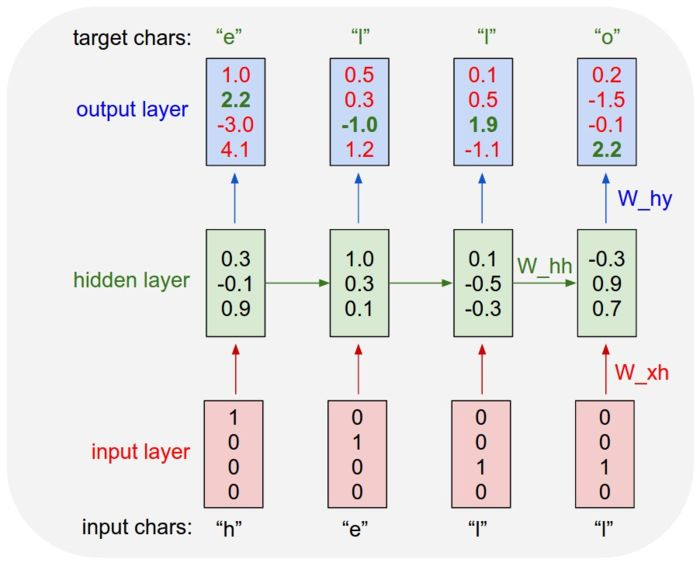

# Language Model Based on Neural Network

Based on [Pytorch](https://github.com/pytorch/pytorch)
- 《[神经网络与深度学习](https://nndl.github.io/)》 第6&15章
- [Dataset](./poetryFromTang.txt) `poetryFromTang.txt`  为空行隔开的诗/词

## Concepts

- 困惑度

    - 困惑度(Perplexity)是信息论的一个概念，可以用来衡量一个分布的不确定性。对于离散随机变量 $X \in \mathcal{X}$，其概率分布为$p(x)$，困惑度为

    $$
    2^{ H(p)}=2^{-\sum_{x \in \mathcal{X}} p(x) \log _{2} p(x)}
    $$

    -   其中$H(p) $为分布$p$的熵。
    -   困惑度也可以用来衡量两个分布之间差异。对于一个未知的数据分布$p_{r}(x)$
        和一个模型分布$p_{\theta}(x)$，我们从$p_{r}(x)$中采样出一组测试样本$x^{(1)}, \cdots, x^{(N)}$，模型分布$p_{\theta}(x)$的困惑度为

    $$
    2^{H\left(\tilde{p}_{r}, p_{\theta}\right)}=2^{-\frac{1}{N} \sum_{n=1}^{N} \log _{2} p_{\theta}\left(x^{(n)}\right)}
    $$

    -   其中 $H\left(\tilde{p}_{r}, p_{\theta}\right)$为样本的经验分布$\tilde{p}_{r}$与模型分布$p_{\theta}$之间的交叉熵，也是所有样本上的负对数似然函数。
    
    -   困惑度可以衡量模型分布与样本经验分布之间的契合程度。困惑度越低则两个分布越接近。因此模型分布$p_{\theta}(x)$的好坏可以用困惑度来评价。
    
    -   假设测试集合共有独立同分布的 N 个序列$\left\{\mathbf{x}_{1 : T_{n}}^{(n)}\right\}_{n=1}^{N}$。我们可以用模型$p_{\theta}(\mathbf{x})$对每个序列计算其概率$p_{\theta}\left(\mathbf{x}_{1 : T_{n}}^{(n)}\right)$，整个测试集的联合概率为
        $$
        \prod_{n=1}^{N} p_{\theta}\left(\mathbf{x}_{1 : T_{n}}^{(n)}\right)=\prod_{n=1}^{N} \prod_{t=1}^{T_{n}} p_{\theta}\left(x_{t}^{(n)} | \mathbf{x}_{1 :(t-1)}^{(n)}\right)
        $$
    
    -   模型$p_{\theta}(x)$的困惑度定义为
        $$
        \operatorname{PPL}(\theta)=2^{-\frac{1}{T} \sum_{n=1}^{N} \log _{2} p_{\theta}\left(\mathbf{x}_{1 : T_{n}}^{(n)}\right)} \\ =2^{-\frac{1}{T} \sum_{n=1}^{N} \sum_{t=1}^{T_{n}} \log _{2} p_{\theta}\left(x_{t}^{(n)} | \mathbf{x}_{1 :(t-1)}^{(n)}\right)}  \\ =\left(\prod_{n=1}^{N} 	\prod_{t=1}^{T_{n}} p_{\theta}\left(x_{t}^{(n)} | \mathbf{x}_{1 :(t-1)}^{(n)}\right)\right)^{-1 / T}
        $$
    
        -   其中 $T=\sum_{n=1}^{N} T_{n}$ 为测试数据集中序列的总长度。可以看出，困惑度为每个词条件概率$p_{\theta}\left(x_{t}^{(n)} | \mathbf{x}_{1 :(t-1)}^{(n)}\right)$的几何平均数的倒数。测试集中所有序列的概率越大，困惑度越小，模型越好。
        -   假设一个序列模型赋予每个词出现的概率均等，即$p_{\theta}\left(x_{t}^{(n)} | \mathbf{x}_{1 :(t-1)}^{(n)}\right)=\frac{1}{|\mathcal{V}|}$，
            则该模型的困惑度为$|\mathcal{V}|$。以英语为例，N元模型的困惑度范围一般为50 ∼ 1000
            之间。
        
    -   理解：
        
        -   训练数据集越大，PPL会下降得更低
        -   数据中的标点会对模型的PPL产生很大影响，标点的预测总是不稳定
        3. 预测语句中的“的，了”等词也对PPL有很大影响，可能“我借你的书”比“我借你书”的指标值小几十，但从语义上分析有没有这些停用词并不能完全代表句子生成的好坏
        3. 语言模型评估时我们可以用perplexity大致估计训练效果，作出判断和分析，但它不是完全意义上的标准，具体问题还是要具体分析。

## Paper

- [Visualizing and Understanding Recurrent Networks](https://arxiv.org/abs/1506.02078)
    - 这篇文章是打开LSTM黑箱的尝试,提供了序列维度上共享权值的合理性证据,对Gates状态的可视化也非常值得关注,最后对误差的分析可能对新的网络结构有所启发
    - 可视化的RNN增强了可解释性
    - 摘要：递归神经网络(RNNs)，特别是一种具有长短时记忆(LSTM)的变体，由于成功地应用于涉及顺序数据的广泛机器学习问题，正重新引起人们的兴趣。然而，尽管LSTMs在实践中提供了非同一般的结果，但是对它们的性能来源及其限制仍然知之甚少。使用字符级语言模型作为可解释的测试平台，我们的目标是通过分析它们的表示、预测和错误类型来弥补这一差距。特别是，我们的实验揭示了可解释单元格的存在，这些单元格跟踪诸如行长度、引号和方括号等长期依赖关系。此外，我们用有限层n-gram模型进行了比较分析，发现LSTM改进的根源在于长期结构依赖关系。最后，对存在的问题进行了分析，并提出了进一步研究的方向。
    - 原理
        - 训练：
        - 
            - 上图为CharRNN结构图。CharRNN将生成任务转化为分类任务，输入"hell"预测"ello"，并且h被编码为“1000”、“e”被编码为“0100”，而“l”被编码为“0010”。
            - CharRNN通过当前词的隐藏状态预测下一个词，把生成问题转化为分类问题
        - 生成：将上一步的输出作为下一步的输入即可
    - 备注：原文使用One-Hot表示词而不是词向量

## Reference

-   [chenyuntc/pytorch-book](<https://github.com/chenyuntc/pytorch-book>)
-   [Char RNN原理介绍以及文本生成实践](<https://www.jianshu.com/p/c55caf4c6467>)
-   [论文笔记：Visualizing and understanding recurrent networks](<https://www.tuicool.com/articles/FvYBneR>)