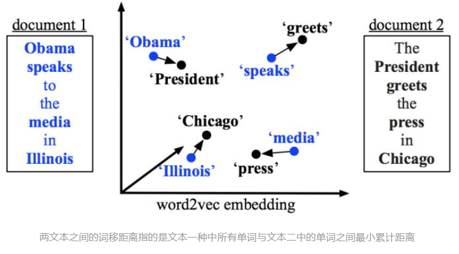
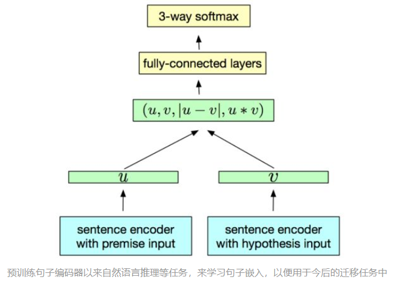

# 夏令营作业

## 作业解析

### 题目

任务：语义相似度计算

-   许多文本信息处理应用（文本分类/文本聚类）的基础。
-   相似度的常见方法：余弦相似度，欧氏距离，编辑距离等

要求：实现计算两个句子语义相似度的方法，并能评价自己所实现的方法的效果

-   句子级的语义相似度计算，利用余弦相似度完成
-   数据集是750个句子对，来自STS2016 Task1
-   计算结果采用Pearson correlation衡量打分序列的相关性
    -   相关度越高，则与人工标注结果越一致
-   展示作业的完成过程、结果、分析和收获

### 数据集

数据集是750个句子对，数据量不大，并且每个句子对均较为短小（TODO： 数据预处理分析）

重要的是，本数据集来自于STS2016的Task1中的新闻标题部分。

## 理论基础

### 文本相似度计算常用算法

-   基于词向量: 余弦相似度, 曼哈顿距离, 欧几里得距离, 明式距离(后两者是前两种距离测度的推广)
-   基于字符: 编辑距离, simhash(适用于海量数据), 共有字符数(有点类似 onehot 编码, 直接统计两个文本的共有字符数, 最naive)
-   基于概率统计: 杰卡德相似系数
-   基于词嵌入模型: word2vec/doc2vec

对于长文本，海量数据的分析，选择SimHash方法去操作，计算快；对于简单的本文分类等问题，可以采用one-hot方法解决（进一步采用贝叶斯等方法）；对于复杂的长文本分析，可以采用主题模型；在深度学习中，对词语的表示可以采用Word2Vec模型；DSSM方法目前主要用于搜索查询问题。 

## 实验设计

采用余弦相似度完成语义相似度计算度，我们首先需要得到句子的向量表示，而后对句子对的向量表示计算余弦相似度。

为得到句子的向量表示，我们可以采用以下方法：

### 统计模型

#### 词袋模型（Bag-Of-Words）

忽视词序，并且词与词之间是独立的

#### N-gram 模型

#### TF-IDF 模型

字词的重要性随着它在文件中出现的次数成正比增加，但同时会随着它在语料库中出现的频率成反比下降。词频 (term frequency, TF) 指的是某一个给定的词语在该文件中出现的次数。这个数字通常会被归一化，以防止它偏向长的文件。逆向文件频率 (inverse document frequency, IDF) 是一个词语普遍重要性的度量。某一特定词语的IDF，可以由总文件数目除以包含该词语之文件的数目，再将得到的商取对数得到。

#### 

### 词嵌入模型

>   词向量来源：Word2Vec、Glove、FastText等预训练得到的词向量
>
>   Word2Vec发布的预训练词向量使用Google News数据集 
>
>   -   GoogleNews-vectors-negative300
>
>   Glove发布的预训练词向量使用Wiki数据集
>
>   -    [Wikipedia 2014](http://dumps.wikimedia.org/enwiki/20140102/) + [Gigaword 5](https://catalog.ldc.upenn.edu/LDC2011T07) 6B tokens, 400K vocab, uncased, 300d vectors——glove.6B.300d
>   -    Common Crawl (840B tokens, 2.2M vocab, cased, 300d vectors, 2.03 GB download): [glove.840B.300d.zip](http://nlp.stanford.edu/data/glove.840B.300d.zip)

-   要判断这类的文本相似性，首先要对短文本对进行embedding，然后计算二者之间的余弦相似度。尽管word2vec和GloVe等词嵌入已经成为寻找单词间语义相似度的标准方法，但是对于句子嵌入应如何计算仍存在不同的声音。

#### 基准方法

估计两句子间语义相似度最简单的方法就是求句子中所有单词词嵌入的平均值，然后计算两句子词嵌入之间的余弦相似性。很显然，这种简单的基准方法会带来很多变数。我们将研究，如果忽略终止词并用TF-IDF计算平均权重会带来怎样的影响。

#### 词移距离

替代上述基准方法的其中一种有趣方法就是词移距离（Word Mover’s Distance）。词移距离使用两文本间的词嵌入，测量其中一文本中的单词在语义空间中移动到另一文本单词所需要的最短距离。

#### Smooth Inverse Frequency

从语义上来讲，求一句话中词嵌入的平均值似乎给与不相关的单词太多权重了。而Smooth Inverse Frequency试着用两种方法解决这一问题：

1.  加权：就像上文用的TF-IDF，SIF取句中词嵌入的平均权重。每个词嵌入都由a/(a + p(w))进行加权，其中a的值经常被设置为0.01，而p(w)是词语在语料中预计出现的频率。
2.  常见元素删除：接下来，SIF计算了句子的嵌入中最重要的元素。然后它减去这些句子嵌入中的主要成分。这就可以删除与频率和句法有关的变量，他们和语义的联系不大。

最后，SIF使一些不重要的词语的权重下降，例如but、just等，同时保留对语义贡献较大的信息。

#### 预训练编码器

上述两种方法都有两个重要的特征。首先，作为简单的词袋方法，它们并不考虑单词的顺序。其次，它们使用的词嵌入是在一种无监督方法中学习到的。这两种特点都有潜在的威胁。由于不同的词语顺序会有不同的意思（例如“the dog bites the man”和“the man bites the dog”），我们想让句子的嵌入对这一变化有所反馈。另外，监督训练可以更直接地帮助句子嵌入学习到句意。

于是就出现了预训练编码器。预训练的句子编码器的目的是充当word2vec和GloVe的作用，但是对于句子嵌入来说：它们生成的嵌入可以用在多种应用中，例如文本分类、近似文本检测等等。一般来说，编码器在许多监督和非监督的任务中训练，目的就是能尽量多地获取通用语义信息。目前已经有好几款这样的编码器了，我们以InferSent和谷歌语句编码器为例。

	

InferSent是由Facebook研发的预训练编码器，它是一个拥有最大池化的BiLSTM，在SNLI数据集上训练，该数据集含有57万英语句子对，所有句子都属于三个类别的其中一种：推导关系、矛盾关系、中立关系。

为了与Facebook竞争，谷歌也推出了自己的语句编码器，它有两种形式：

-   其中一种高级模型，采用的是变换过的模型编码子图生成的语境感知词所表示的元素总和。
-   另一种是简单一些的深度平均网络（DAN），其中输入的单词和双字符的嵌入相加求平均数，并经过一个前馈深层神经网络。

基于变换的模型的结果更好，但是在书写的时候，只有基于DAN的编码器可用。与InferSent不同，谷歌的橘子编码器是在监督数据和非监督数据上共同训练的。

## Reference

[四种计算文本相似度的方法对比](https://zhuanlan.zhihu.com/p/37104535) [Simple Sentence Similarity.ipynb](https://github.com/nlptown/nlp-notebooks/blob/master/Simple%20Sentence%20Similarity.ipynb)

[从0到1，了解NLP中的文本相似度](https://zhuanlan.zhihu.com/p/57856690)

[使用余弦相似度算法计算文本相似度](https://zhuanlan.zhihu.com/p/57856690)

[NLP文本相似度(TF-IDF)](https://www.cnblogs.com/liangjf/p/8283519.html)

https://github.com/facebookresearch/InferSent

https://github.com/facebookresearch/SentEval

