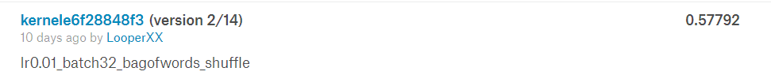
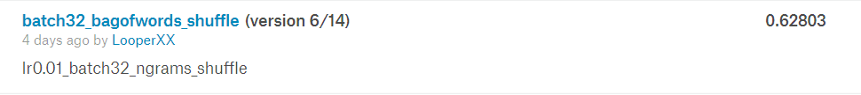
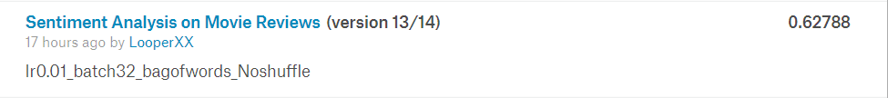
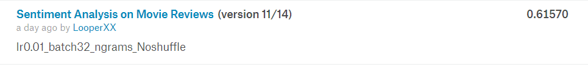
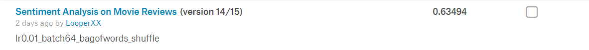
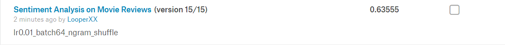
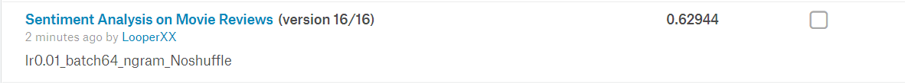
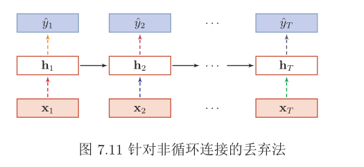
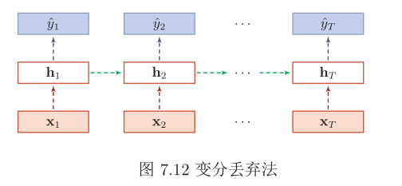
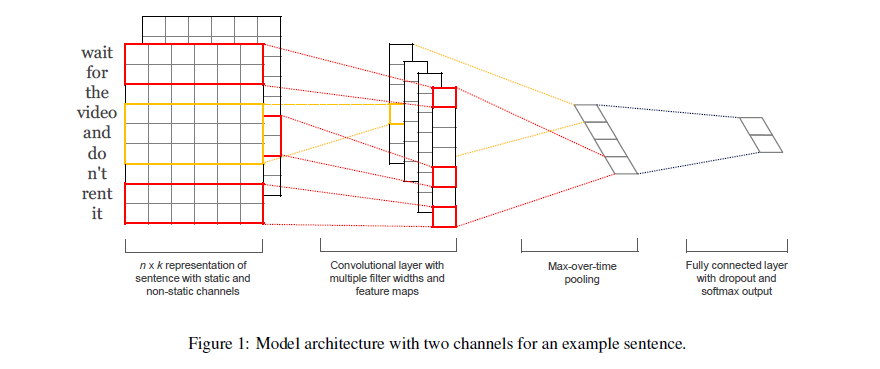

# NLPTry

尝试依据[NLP上手教程](<https://github.com/FudanNLP/nlp-beginner>)的要求，完成NLP的入门练习

配合[《神经网络与深度学习》](https://nndl.github.io/)食用更佳

各Task内的`md`文件对学习亦有帮助，本文件是对其重要内容整合

`Github`的`md`不支持`Latex`公式渲染，可本地使用`Typora`等软件查看

## Content

The implementation of basic model in the following tasks:

- Text Classification
- Text Matching
- Sequence Annotation
- Language Model

## Dependency
-   Python == 3.7.0
-   Numpy == 1.16.3
-   PyTorch == 1.1.0
-   TorchText == 0.3.1
-   NLTK == 3.4.1

## Implement Details

### Task 1: 基于机器学习的文本分类

#### 数据预处理

-   `pandas`读取`tsv`格式的数据集并使用`re`库与`NLTK`库进行预处理，包括非字母的数据清洗、英文分词、大小写转换、停用词过滤
-   数据集划分与打乱
-   Ngram的含义
    -   unigram 充分性
    -   bigram trigram 流畅性
-   Ngram的提取
    -   频度阈值过滤
    -   停用词过滤
-   vocabulary、word2index、index2word、ngram2index、index2ngram词典的建立
-   词袋/Ngram的One-hot表示

#### 模型

-   基于`Numpy`实现多层神经网络，实现前向传播和反向传播
-   实现交叉熵损失函数以及GD、BGD、SGD

#### 实验

-   分析词袋/Ngram特征、数据集Shuffle、Batch_size对性能的影响
-   基于Kaggle平台进行实验
    -   
    -   
    -   
    -   
    -   
    -   
    -   

### Task 2: 基于深度学习的文本分类

#### 知识准备

-   [Dataset](https://www.kaggle.com/c/sentiment-analysis-on-movie-reviews) 

-   [Word Emebedding](https://nlp.stanford.edu/projects/glove/)

-   学习使用[TorchText](https://github.com/pytorch/text)处理数据集(😄真的香)

-   Dropout [《神经网络与深度学习》](https://nndl.github.io/) `P190`

    -   目的：缓解过拟合问题，一定程度上达到正则化的效果

    -   效果：减少下层节点对其的依赖，迫使网络去学习更加**鲁棒**的特征

    -   **集成学习的解释** :thumbsup:

        -   每做一次丢弃，相当于从原始的网络中采样得到一个子网络。
            如果一个神经网络有$n$个神经元，那么总共可以采样出$2^n$个子网络。每次迭代都相当于训练一个不同的子网络，这些子网络都共享原始网络的参数。那么，最终的网络可以近似看作是集成了指数级个不同网络的组合模型。

    -   **贝叶斯学习的解释**  :thumbsup: 

        -   丢弃法也可以解释为一种贝叶斯学习的近似。用$y=f(\mathbf{x}, \theta)$来表示要学习的神经网络，贝叶斯学习是假设参数$\theta$为随机向量，并且先验分布为$q(\theta)$，贝叶斯方法的预测为

        $$
        \begin{aligned} \mathbb{E}_{q(\theta)}[y] &=\int_{q} f(\mathbf{x}, \theta) q(\theta) d \theta \\ & \approx \frac{1}{M} \sum_{m=1}^{M} f\left(\mathbf{x}, \theta_{m}\right) \end{aligned}
        $$

        -   其中$f(\mathbf{x}, \theta_m)$为第m次应用丢弃方法后的网络，其参数$\theta_m$为对全部参数$\theta$的一次采样。

    -   RNN中的变分Dropout [Variational Dropout](<https://arxiv.org/abs/1512.05287>)

        -   Dropout一般是针对神经元进行随机丢弃，但是也可以扩展到对神经元之间
            的连接进行随机丢弃，或每一层进行随机丢弃。

        -   在RNN中，不能直接对每个时刻的隐状态进行随机
            丢弃，这样会损害循环网络在时间维度上记忆能力。

        -   一种简单的方法是对非时间维度的连接（即非循环连接）进行随机丢失。如图所示，虚线边表示进行随机丢弃，不同的颜色表示不同的丢弃掩码。

            

        -   然而根据贝叶斯学习的解释，丢弃法是一种对参数$θ$的采样。每次采样的参数需要在每个时刻保持不变。因此，在对循环神经网络上使用丢弃法时，需要对参数矩阵的每个元素进行随机丢弃，并在所有时刻都使用相同的丢弃掩码。这种方法称为变分丢弃法（Variational Dropout）。
            图7.12给出了变分丢弃法的示例，**相同颜色表示使用相同的丢弃掩码**。

        

#### 模型

-   TextCNN [Convolutional Neural Networks for Sentence Classification](https://arxiv.org/abs/1408.5882) 

    

    -   使用Glove初始化Embedding
    -   使用TorchText的Field、TabularDataset和BucketIterator组件完成方便快捷的初始化

-   [LSTM](https://machinelearningmastery.com/sequence-classification-lstm-recurrent-neural-networks-python-keras/)
-   模型方面没有复杂处理，只是Pytorch的简单使用

#### 实验

-   [ ] Glove初始化词嵌入和随机初始化的差别 
-   [ ] CNN/RNN的特征抽取的效果差别
-   [ ] Dropout的效果影响

### Task 3: 基于注意力机制的文本匹配

#### 知识准备

-   [Dataset](https://nlp.stanford.edu/projects/snli/) `SNLI` 
-   [Word Emebedding](https://nlp.stanford.edu/projects/glove/) 

-   Recognizing textual entailment (RTE)
    -   判断两个文本序列premise和hypothesis之间的是否存在蕴含关系，是一个分类问题。（蕴含/矛盾/无关）
        -   contradicting each other
        -   not related
        -   the first sentence (called premise) entails the second sentence (called
            hypothesis).
    -   许多自然语言处理问题，如信息提取、关系提取、文本摘要或机器翻译，都依赖于它，并且可以从更精确的RTE系统中获益

-   Attention Mechanism
    -   [这里](<https://looperxx.github.io/My_wiki/Attention/>) 是我关于注意力机制的完整学习笔记
-   `Token2Token Attention`
    -   思想仍然是传统的source与target之间的attention
    -   创新之处在于attention计算的层次更加深入
        -   本任务原来的Attention是通过两个LSTM最终计算出的$h_N$计算出Attention权重
        -   为了使Attention的层次从sequence深入至token，本文在第二个LSTM端，对每一$h_t$都计算此刻的权重并计算出此刻的 $r_t$ (计算中引入了$r_{t-1}$)，不再是借助整个sequence的最终特征计算权重，而是针对每一token都计算出$r_t$并将最终的$r_N$与$h_N$融合

#### 模型

##### 论文

[Reasoning about Entailment with Neural Attention](https://arxiv.org/abs/1509.06664) 

-   摘要: 自动识别自然语言句子对之间的隐含关系，一直是利用人工工程特征的分类器的优势。直到最近，端到端可微神经结构还没有达到最先进的性能。在本文中，我们提出了一个神经模型，使用长短时记忆单元读取两个句子从而确定蕴含关系。我们通过一个逐字的神经注意机制来扩展这个模型，该机制鼓励对的单词对和短语对进行推理。此外，我们对该模型产生的注意权重进行了定性分析，证明了这种推理能力。在一个大数据集上，该模型比之前的最佳神经模型和具有工程特征的分类器有很大的优势。它是第一个通用的端到端可微系统，实现了对文本数据集的最先进的准确性。
-   介绍
    -   RTE的端到端
    -   可微解决方案是可取的，因为它避免了对底层语言的特定假设。**特别是，不需要像词性标记或依赖解析这样的语言特性**。此外，一个通用的seq2seq解决方案允许跨任何序列数据，扩展捕获蕴含的概念，而不仅仅是自然语言。
        -   Bowman等人的LSTM将前提和假设编码为密集的定长向量，然后将其串联在多层感知器(MLP)中进行分类。这表明LSTM可以学习语义丰富的句子表示，这些句子表示适合于确定文本的蕴涵。相比之下，我们提出了一种专注的神经网络，它能够通过处理前提条件下的假设，对成对的单词和短语进行推理。
        -   贡献 Seq2Seq + Attention
            -   我们提出了一个基于LSTM的神经模型，它可以一次读取两个语句来确定蕴涵关系。而不是将每个句子单独映射到一个语义空间。
            -   我们通过一个word-by-word的注意机制来扩展这个模型，以鼓励对成对单词和短语进行推理
            -   我们为RTE提供了一个详细的神经注意定性分析。
-   模型
    -   与学习句子表示不同的是，我们感兴趣的是神经模型，它能读懂两个句子来确定句子之间的关联，从而推断出成对的单词和短语之间的关联。
        -   模型架构图
            -   LSTM分别read前提与假设，并且read假设的LSTM的cell state初始化为前一LSTM的last cell state，并且读入一个定界符。
            -   使用Word2Vec并且不对其进行优化。OOV的单词初始化为(-0.05,0.05)的均匀分布并且在训练中进行优化。将val与test时的OOV单词设置为固定的随机向量。
            -   将最后一个hidden state经过非线性激活后，使用softmax进行多分类(ENTAILMENT, NEUTRAL or CONTRADICTION)，损失函数为交叉熵。
            -   使用attention机制，使模型不受cell state的瓶颈限制
                -   
                -   $\mathbf{Y} \in \mathbb{R}^{k \times L}$ 是由第一个LSTM读取了长度为L的前提后的输出向量$\left[\mathbf{h}_{1} \cdots \mathbf{h}_{L}\right]$
                -   k是embeddings和hidden layers的维数
                -   最终用于分类的表示为$\mathbf{h}^{*}=\tanh \left(\mathbf{W}^{p} \mathbf{r}+\mathbf{W}^{x} \mathbf{h}_{N}\right) \quad \mathbf{h}^{*} \in \mathbb{R}^{k}$
            -   它一次读取两个句子来确定两个句子之间的蕴含关系，而不是将每个句子独立映射到一个语义空间。我们引入逐字的（word-by-word）Attention Mechanism来扩展这个模型，来强化模型对单词或短语对的关系推理能力。
                -   通过在前提和假设中对单词和短语进行软对齐，获得句子对编码。在我们的例子中，这相当于在第二个LSTM每次处理一个单词时都关注第一个LSTM的输出向量，从而为假设中的每个单词生成注意权重
                -   
                -   最终用于分类的表示为$\mathbf{h}^{*}=\tanh \left(\mathbf{W}^{p} \mathbf{r}_{L}+\mathbf{W}^{x} \mathbf{h}_{N}\right) \quad \mathbf{h}^{*} \in \mathbb{R}^{k}$
            -   Two-way Attention: 将前提与假设对调 生成的两个表示concatenate后分类

-   [ ] [Enhanced LSTM for Natural Language Inference](https://arxiv.org/abs/1609.06038v3)

#### 实验

[Reasoning about Entailment with Neural Attention](https://arxiv.org/abs/1509.06664) 

-   这篇论文对实验细节解释的很详细，唯一未说明的是对Word-By-Word Attention中的Representation的初始化，本实验中我选择初始化为0

-   本实验不借助TorchText完成数据集的预处理与词向量的初始化，参照[Ohio University Homework](https://github.com/qfettes/ReasoningAboutEntailmentWithNeuralAttention)的部分内容，手工完成了词向量的加载和数据集的预处理
-   逐步实现了Original的Attention、Word-By-Word Attention和Two-Way Attention :cry: 公式来回推 矩阵size不能乱
-   手工实现变长序列处理，依靠Mask矩阵和`gather`函数

### Task 4: 基于LSTM+CRF的序列标注

所有任务中难度最大的就是这一任务。

-   序列标注的学习
-   CharRNN的结构学习
-   CRF需要对概率图模型进行系统学习，并且要掌握CRF与LSTM在序列标注问题上的思路与效果

#### 知识准备

[Dataset](https://www.clips.uantwerpen.be/conll2003/ner/)

##### 序列标注

序列标注问题包括自然语言处理中的分词，词性标注，命名实体识别，关键词抽取，词义角色标注等等。我们只要在做序列标注时给定特定的标签集合，就可以进行序列标注。

序列标注问题是NLP中最常见的问题，因为绝大多数NLP问题都可以转化为序列标注问题，虽然很多NLP任务看上去大不相同，但是如果转化为序列标注问题后其实面临的都是同一个问题。所谓“序列标注”，就是说对于一个一维线性输入序列：

给线性序列中的每个元素打上标签集合中的某个标签：

所以，其本质上是对线性序列中每个元素根据上下文内容进行分类的问题。一般情况下，对于NLP任务来说，线性序列就是输入的文本，往往可以把一个token(level不定)看做线性序列的一个元素，而不同任务其标签集合代表的含义可能不太相同，但是相同的问题都是：如何根据token的上下文给token打上一个合适的标签（无论是分词，还是词性标注，或者是命名实体识别，道理都是相通的）

##### 评价指标

`F1 score` 是`NMT`领域的常用指标

-   预测结果和答案之间的平均单词重叠 `the average word overlap`
-   预测结果和答案被处理为符号级别，符号级别的`F1 score`计算公式如下：

$$
F1 = \frac{2 * Precision * Recall}{Precision + Recall}
$$

$$
Precision = \frac{TP}{TP+FP} // 预测为正的样本的正确率 查准率
$$

$$
Recall = \frac{TP}{TP+FN} // 正样本的中预测正确的部分
$$

-   为了让评估更加可靠，我们会对每个问题给出多个标准答案，因此EM中只要和一个标准答案一致即可，F1则是计算预测结果和所有标准答案的最大得分

##### CRF

　　**LSTM：**像RNN、LSTM、BILSTM这些模型，它们在序列建模上很强大，它们能够capture长远的上下文信息，此外还具备神经网络拟合非线性的能力，这些都是crf无法超越的地方，对于t时刻来说，输出层yt受到隐层ht（包含上下文信息）和输入层xt（当前的输入）的影响，但是yt和其他时刻的yt‘是相互独立的，感觉像是一种point wise，对当前t时刻来说，我们希望找到一个概率最大的yt，但其他时刻的yt’ 对当前yt没有影响，**如果yt之间存在较强的依赖关系的话**（例如，形容词后面一般接名词，存在一定的约束），LSTM无法对这些约束进行建模，LSTM模型的性能将受到限制。

　　**CRF：**它不像LSTM等模型，能够考虑长远的上下文信息，**它更多考虑的是整个句子的局部特征的线性加权组合（通过特征模版去扫描整个句子）**。关键的一点是，CRF的模型为p(y | x, w)，注意这里y和x都是序列，它有点像list wise，优化的是一个序列y = (y1, y2, …, yn)，而不是某个时刻的yt，即找到一个概率最高的序列y = (y1, y2, …, yn)使得p(y1, y2, …, yn| x, w)最高，它计算的是一种联合概率，优化的是整个序列（最终目标），而不是将每个时刻的最优拼接起来，在这一点上CRF要优于LSTM。

　　**HMM：**CRF不管是在实践还是理论上都要优于HMM，HMM模型的参数主要是“初始的状态分布”，“状态之间的概率转移矩阵”，“状态到观测的概率转移矩阵”，这些信息在CRF中都可以有，例如：在特征模版中考虑h(y1), f(yi-1, yi), g(yi, xi)等特征。

　　**CRF与LSTM：**从数据规模来说，在数据规模较小时，CRF的试验效果要略优于BILSTM，当数据规模较大时，BILSTM的效果应该会超过CRF。从场景来说，如果需要识别的任务不需要太依赖长久的信息，此时RNN等模型只会增加额外的复杂度，此时可以考虑类似科大讯飞**FSMN**（一种基于窗口考虑上下文信息的“前馈”网络）。

　　**CNN＋BILSTM＋CRF：**这是目前学术界比较流行的做法，BILSTM＋CRF是为了结合以上两个模型的优点，CNN主要是处理英文的情况，英文单词是由更细粒度的字母组成，这些字母潜藏着一些特征（例如：前缀后缀特征），通过CNN的卷积操作提取这些特征，在中文中可能并不适用（中文单字无法分解，除非是基于分词后），这里简单举一个例子，例如词性标注场景，单词football与basketball被标为名词的概率较高， 这里后缀ball就是类似这种特征。

#### 模型

[End-to-end Sequence Labeling via Bi-directional LSTM-CNNs-CRF](https://arxiv.org/abs/1603.01354)  

>   论文中作者并未详细介绍CRF在模型中的计算流程，其在github上发布的repo中做出来详细介绍

##### 摘要

最先进的序列标记系统通常以手工制作的特征和数据预处理的形式引入大量的任务特定的知识。本文介绍了一种利用双向LSTM与CNN和CRF相结合的新型网络结构，该结构能自动地从字级和字级表示中获益。我们的系统是真正的端到端的，不需要任何特征工程或数据预处理，因此适用于大范围的序列任务。该模型在PennTreebank WSJ词性标注任务和CoNLL 2003 词性标注数据集上取得优异的成绩，前者97.55%的准确率，后者取得91.21%的F1值。

##### 简介

-   大部分传统的高效模型是线性统计模型，包括HMM，CRF等。传统序列标注模型存在的问题：
    -   大多数是基于线性的统计语言模型
    -   基于大量的人工特征
    -   需要大量的外部数据，比如名称库
    -   普适性差
-   上述问题导致其难以适用到新的任务/领域
-   近些年有一些非线性神经网络模型用词向量（Word Embedding）作为输入，颇为成功。有前馈神经网络、循环神经网络（RNN）、长短期记忆模型（LSTM）、GRU，取得了很有竞争力的结果。
    -   它们把词向量用来增强而不是取代原来的手工特征
    -   另一方面，如果这些模型完全依赖于神经嵌入，那么性能下降非常快
-   本文贡献
    -   一种用于语言序列标记的新型神经网络架构
    -   两个经典NLP任务的基准数据集的经验评估
    -   最先进的性能与真正的端到端系统
        -   没有任务特定的资源
        -   没有特征工程
        -   除却预先训练的单词嵌入，没有在未标记的语料库上的数据预处理

##### 网络结构

###### CNN for Character-level Representation

CNN的优点是可以高效地学习形态学特征，比如单词的前缀或者后缀、大小写等

-   只使用字符嵌入作为CNN的输入，没有字符类型特性
-   字符嵌入输入CNN前经过一层Dropout层

###### Bi-directional LSTM

-   把CNN获得的单词表示和事先训练好的词向量拼接起来，输入BiLSTM得到每个状态的表示。
-   BiLSTM的输入和输出都使用Dropout层

###### CRF

将BiLSTM的输出向量作为CRF层的输入，最终预测出序列

用 $\mathbf{Z}=\left\{\mathbf{z}_{1}, \cdots, \mathbf{z}_{n}\right\}$ 代表通用输入序列， $ z_i $是$i$th词的输入向量. $y=\left\{y_{1}, \cdots, y_{n}\right\}$代表 $z$ 的标签.
$\mathcal{Y}(\mathbf{z})$ 表示 $z$ 的可能标签集合。序列CRF的概率模型对于所有的给定 $\boldsymbol z$ 的标签序列$\boldsymbol y$ 定义了一类条件概率 $p(\boldsymbol{y} | \mathbf{z} ; \mathbf{W}, \mathbf{b})$
$$
p(\boldsymbol{y} | \mathbf{z} ; \mathbf{W}, \mathbf{b})=\frac{\prod_{i=1}^{n} \psi_{i}\left(y_{i-1}, y_{i}, \mathbf{z}\right)}{\sum_{y^{\prime} \in \mathcal{Y}(\mathbf{z})} \prod_{i=1}^{n} \psi_{i}\left(y_{i-1}^{\prime}, y_{i}^{\prime}, \mathbf{z}\right)}
$$
$\psi_{i}\left(y^{\prime}, y, \mathbf{z}\right)=\exp \left(\mathbf{W}_{y^{\prime}, y}^{T} \mathbf{z}_{i}+\mathbf{b}_{y^{\prime}, y}\right)$ 是可能性函数，$\mathbf{W}_{y^{\prime}, y}^{T}$ 和$\mathbf{b}_{y^{\prime}, y}$分别是为标签对$\left(y^{\prime}, y\right)$对应的权向量和偏置

Loss使用最大条件似然估计，对于训练集$\left\{\left(\mathbf{z}_{i}, \boldsymbol{y}_{i}\right)\right\}$
$$
L(\mathbf{W}, \mathbf{b})=\sum_{i} \log p(\boldsymbol{y} | \mathbf{z} ; \mathbf{W}, \mathbf{b})
$$
搜索条件概率最高的标签序列$y^{*}$
$$
y^{*}=\underset{y \in \mathcal{Y}(\mathbf{z})}{\operatorname{argmax}} p(\boldsymbol{y} | \mathbf{z} ; \mathbf{W}, \mathbf{b})
$$
对于一个序列CRF模型(只考虑两个连续标签之间的交互作用)，采用`Viterbi`算法可以有效地解决训练和解码问题。

$$ \begin{align*} C(y_1, \ldots, y_m) &= b[y_1] &+ \sum_{t=1}^{m} s_t [y_t] &+ \sum_{t=1}^{m-1} T[y_{t}, y_{t+1}] &+ e[y_m] \\ &= \text{begin} &+ \text{scores} &+ \text{transitions} &+ \text{end} \end{align*}$$

###### BLSTM-CNNs-CRF

对于每个单词，CNN用字符嵌入作为输入计算字符级表示。然后，将字符级表示向量与单词嵌入向量连接起来，以提供给BiLSTM网络。最后，将BiLSTM的输出向量输入CRF层，共同解码出最佳标签序列。BiLSTM的输入和输出都使用Dropout层。

##### 实验设置

Word Embedding 使用 `Glove`

Character Embedding 初始化为 $\left[-\sqrt{\frac{3}{\operatorname{dim}}},+\sqrt{\frac{3}{\operatorname{dim}}}\right]$ 的 均匀分布，dim = 30

Weight Matrix初始化为$\left[-\sqrt{\frac{6}{r+c}},+\sqrt{\frac{6}{r+c}}\right]$ 的均匀分布，$r,c$分别代表其行数和列数

Bias 初始化为0，但LSTM中的遗忘门的$b_f$ 初始化为1

使用了SGD优化，梯度衰减和梯度裁剪(基于范数)，使用Early Stop和Dropout(CNN输入、LSTM的输入和输出)，并对所有自初始化的Embedding进行微调

##### 总结

本文提出了一种用于序列标记的神经网络结构。它是一个真正的端到端模型，不依赖于特定于任务的资源、特性工程或数据预处理。与之前最先进的系统相比，我们在两个语言序列标记任务上取得了最先进的性能。

未来的工作有几个潜在的方向。首先，我们的模型可以进一步改进，探索多任务学习方法，结合更多有用和相关的信息。例如，我们可以用POS和NER标签共同训练一个神经网络模型来改进我们在网络中学习到的中间表示。另一个有趣的方向是将我们的模型应用于其他领域的数据，如社交媒体(Twitter和微博)。由于我们的模型不需要任何特定于领域或任务的知识，所以可能很容易将它应用到这些领域

### Task 5: 基于神经网络的语言模型

#### 知识准备

-   《[神经网络与深度学习](https://nndl.github.io/)》 第6&15章
-   [Dataset](./poetryFromTang.txt) `poetryFromTang.txt`  为空行隔开的诗/词

困惑度

-   困惑度(Perplexity)是信息论的一个概念，可以用来衡量一个分布的不确定性。对于离散随机变量 $X \in \mathcal{X}$，其概率分布为$p(x)$，困惑度为

$$
2^{ H(p)}=2^{-\sum_{x \in \mathcal{X}} p(x) \log _{2} p(x)}
$$

-   其中$H(p) $为分布$p$的熵。
-   困惑度也可以用来衡量两个分布之间差异。对于一个未知的数据分布$p_{r}(x)$
    和一个模型分布$p_{\theta}(x)$，我们从$p_{r}(x)$中采样出一组测试样本$x^{(1)}, \cdots, x^{(N)}$，模型分布$p_{\theta}(x)$的困惑度为

$$
2^{H\left(\tilde{p}_{r}, p_{\theta}\right)}=2^{-\frac{1}{N} \sum_{n=1}^{N} \log _{2} p_{\theta}\left(x^{(n)}\right)}
$$

-   其中 $H\left(\tilde{p}_{r}, p_{\theta}\right)$为样本的经验分布$\tilde{p}_{r}$与模型分布$p_{\theta}$之间的交叉熵，也是所有样本上的负对数似然函数。

-   困惑度可以衡量模型分布与样本经验分布之间的契合程度。困惑度越低则两个分布越接近。因此模型分布$p_{\theta}(x)$的好坏可以用困惑度来评价。

-   假设测试集合共有独立同分布的 N 个序列$\left\{\mathbf{x}_{1 : T_{n}}^{(n)}\right\}_{n=1}^{N}$。我们可以用模型$p_{\theta}(\mathbf{x})$对每个序列计算其概率$p_{\theta}\left(\mathbf{x}_{1 : T_{n}}^{(n)}\right)$，整个测试集的联合概率为
    $$
    \prod_{n=1}^{N} p_{\theta}\left(\mathbf{x}_{1 : T_{n}}^{(n)}\right)=\prod_{n=1}^{N} \prod_{t=1}^{T_{n}} p_{\theta}\left(x_{t}^{(n)} | \mathbf{x}_{1 :(t-1)}^{(n)}\right)
    $$

-   模型$p_{\theta}(x)$的困惑度定义为
    $$
    \operatorname{PPL}(\theta)=2^{-\frac{1}{T} \sum_{n=1}^{N} \log _{2} p_{\theta}\left(\mathbf{x}_{1 : T_{n}}^{(n)}\right)} \\ =2^{-\frac{1}{T} \sum_{n=1}^{N} \sum_{t=1}^{T_{n}} \log _{2} p_{\theta}\left(x_{t}^{(n)} | \mathbf{x}_{1 :(t-1)}^{(n)}\right)}  \\ =\left(\prod_{n=1}^{N} 	\prod_{t=1}^{T_{n}} p_{\theta}\left(x_{t}^{(n)} | \mathbf{x}_{1 :(t-1)}^{(n)}\right)\right)^{-1 / T}
    $$

    -   其中 $T=\sum_{n=1}^{N} T_{n}$ 为测试数据集中序列的总长度。可以看出，困惑度为每个词条件概率$p_{\theta}\left(x_{t}^{(n)} | \mathbf{x}_{1 :(t-1)}^{(n)}\right)$的几何平均数的倒数。测试集中所有序列的概率越大，困惑度越小，模型越好。
    -   假设一个序列模型赋予每个词出现的概率均等，即$p_{\theta}\left(x_{t}^{(n)} | \mathbf{x}_{1 :(t-1)}^{(n)}\right)=\frac{1}{|\mathcal{V}|}$，
        则该模型的困惑度为$|\mathcal{V}|$。以英语为例，N元模型的困惑度范围一般为50 ∼ 1000
        之间。

-   理解：

    -   训练数据集越大，PPL会下降得更低
    -   数据中的标点会对模型的PPL产生很大影响，标点的预测总是不稳定
    -   预测语句中的“的，了”等词也对PPL有很大影响，可能“我借你的书”比“我借你书”的指标值小几十，但从语义上分析有没有这些停用词并不能完全代表句子生成的好坏
    -   语言模型评估时我们可以用perplexity大致估计训练效果，作出判断和分析，但它不是完全意义上的标准，具体问题还是要具体分析。

#### 模型

[Visualizing and Understanding Recurrent Networks](https://arxiv.org/abs/1506.02078)

-   这篇文章是打开LSTM黑箱的尝试,提供了序列维度上共享权值的合理性证据,对Gates状态的可视化也非常值得关注,最后对误差的分析可能对新的网络结构有所启发
-   可视化的RNN增强了可解释性
-   摘要：递归神经网络(RNNs)，特别是一种具有长短时记忆(LSTM)的变体，由于成功地应用于涉及顺序数据的广泛机器学习问题，正重新引起人们的兴趣。然而，尽管LSTMs在实践中提供了非同一般的结果，但是对它们的性能来源及其限制仍然知之甚少。使用字符级语言模型作为可解释的测试平台，我们的目标是通过分析它们的表示、预测和错误类型来弥补这一差距。特别是，我们的实验揭示了可解释单元格的存在，这些单元格跟踪诸如行长度、引号和方括号等长期依赖关系。此外，我们用有限层n-gram模型进行了比较分析，发现LSTM改进的根源在于长期结构依赖关系。最后，对存在的问题进行了分析，并提出了进一步研究的方向。
-   原理
    -   训练：
    -   
        -   上图为CharRNN结构图。CharRNN将生成任务转化为分类任务，输入"hell"预测"ello"，并且h被编码为“1000”、“e”被编码为“0100”，而“l”被编码为“0010”。
        -   CharRNN通过当前词的隐藏状态预测下一个词，把生成问题转化为分类问题
    -   生成：将上一步的输出作为下一步的输入即可
-   备注：原文使用One-Hot表示词而不是词向量

#### 实验

-   实现了CharRNN模型的训练与困惑度计算
-   实现了诗句生成与藏头诗生成以及意境控制

## Task Details

>   以下内容源自[NLP上手教程](<https://github.com/FudanNLP/nlp-beginner>) 

### 任务一：基于机器学习的文本分类

实现基于logistic/softmax regression的文本分类

-   参考
    -   [文本分类](https://github.com/FudanNLP/nlp-beginner/blob/master/文本分类.md)
    -   《[神经网络与深度学习](https://nndl.github.io/)》 第2/3章

-   数据集：[Classify the sentiment of sentences from the Rotten Tomatoes dataset](https://www.kaggle.com/c/sentiment-analysis-on-movie-reviews)

-   实现要求：NumPy
-   需要了解的知识点
    -   文本特征表示：Bag-of-Word，N-gram
    -   分类器：logistic/softmax regression，损失函数、（随机）梯度下降、特征选择
    -   数据集：训练集/验证集/测试集的划分
-   实验
    -   分析不同的特征、损失函数、学习率对最终分类性能的影响
    -   shuffle 、batch、mini-batch

### 任务二：基于深度学习的文本分类

熟悉Pytorch，用Pytorch重写《任务一》，实现CNN、RNN的文本分类；

-   参考
    -   <https://pytorch.org/>
    -   Convolutional Neural Networks for Sentence Classification <https://arxiv.org/abs/1408.5882>
    -   <https://machinelearningmastery.com/sequence-classification-lstm-recurrent-neural-networks-python-keras/>

-   word embedding 的方式初始化
-   随机embedding的初始化方式
-   用glove 预训练的embedding进行初始化 <https://nlp.stanford.edu/projects/glove/>
-   知识点：
    -   CNN/RNN的特征抽取
    -   词嵌入
    -   Dropout

### 任务三：基于注意力机制的文本匹配

输入两个句子判断，判断它们之间的关系。参考[ESIM](https://arxiv.org/pdf/1609.06038v3.pdf)（可以只用LSTM，忽略Tree-LSTM），用双向的注意力机制实现。

-   参考
    -   《[神经网络与深度学习](https://nndl.github.io/)》 第7章
    -   Reasoning about Entailment with Neural Attention <https://arxiv.org/pdf/1509.06664v1.pdf>
    -   Enhanced LSTM for Natural Language Inference <https://arxiv.org/pdf/1609.06038v3.pdf>

-   数据集：<https://nlp.stanford.edu/projects/snli/>
-   实现要求：Pytorch
-   知识点
    -   注意力机制
    -   token2token attetnion

### 任务四：基于LSTM+CRF的序列标注

用LSTM+CRF来训练序列标注模型：以Named Entity Recognition为例。

-   参考
    -   《[神经网络与深度学习](https://nndl.github.io/)》 第6、11章
    -   <https://arxiv.org/pdf/1603.01354.pdf>
    -   <https://arxiv.org/pdf/1603.01360.pdf>
-   数据集：CONLL 2003，<https://www.clips.uantwerpen.be/conll2003/ner/
-   实现要求：Pytorch
-   知识点
    -   评价指标：precision、recall、F1
    -   无向图模型、CRF

### 任务五：基于神经网络的语言模型

用LSTM、GRU来训练字符级的语言模型，计算困惑度

-   参考
    -   《[神经网络与深度学习](https://nndl.github.io/)》 第6、15章
-   数据集：poetryFromTang.txt
-   实现要求：Pytorch
-   知识点
    -   语言模型：困惑度等
    -   文本生成

## Reference

-   [深度文本匹配发展总结](https://blog.csdn.net/xiayto/article/details/81247461)
-   [Ohio University Homework](https://github.com/qfettes/ReasoningAboutEntailmentWithNeuralAttention)
-   [entailment-neural-attention-lstm-tf](<https://github.com/borelien/entailment-neural-attention-lstm-tf/blob/master/python/network.py>)
-   [使用RNN解决NLP中序列标注问题的通用优化思路](<https://blog.csdn.net/malefactor/article/details/50725480>)
-   [一文详解深度学习在命名实体识别(NER)中的应用](http://www.52nlp.cn/%E4%B8%80%E6%96%87%E8%AF%A6%E8%A7%A3%E6%B7%B1%E5%BA%A6%E5%AD%A6%E4%B9%A0%E5%9C%A8%E5%91%BD%E5%90%8D%E5%AE%9E%E4%BD%93%E8%AF%86%E5%88%ABner%E4%B8%AD%E7%9A%84%E5%BA%94%E7%94%A8)
-   [Implementation of BiLSTM-CNNs-CRF](<https://github.com/jayavardhanr/End-to-end-Sequence-Labeling-via-Bi-directional-LSTM-CNNs-CRF-Tutorial>)
-   [ADVANCED: MAKING DYNAMIC DECISIONS AND THE BI-LSTM CRF](<https://pytorch.org/tutorials/beginner/nlp/advanced_tutorial.html#sphx-glr-beginner-nlp-advanced-tutorial-py>)
-   [CRFS](<http://www.cs.columbia.edu/~mcollins/crf.pdf>)
-   [概率图模型学习笔记：HMM、MEMM、CRF](<https://www.zhihu.com/question/35866596/answer/236886066>)
-   [采样方法](<https://blog.csdn.net/Dark_Scope/article/details/70992266>) [采样方法](<https://blog.csdn.net/Dark_Scope/article/details/78937731>)
-   [Viterbi-Algorithm（维特比）算法](<https://blog.csdn.net/meiqi0538/article/details/80960128>)
-   [论文笔记：[ACL2016]End-to-end Sequence Labeling via Bi-directional LSTM-CNNs-CRF](<https://blog.csdn.net/youngdreamnju/article/details/54346658>)
-   [通俗理解BiLSTM-CRF命名实体识别模型中的CRF层](https://www.cnblogs.com/createMoMo/p/7529885.html)
-   [命名实体识别CoNLL2003](https://yuanxiaosc.github.io/2018/12/26/%E5%91%BD%E5%90%8D%E5%AE%9E%E4%BD%93%E8%AF%86%E5%88%ABCoNLL2003/)
-   [自然语言处理之序列标注问题](https://www.cnblogs.com/jiangxinyang/p/9368482.html)
-   [HMM学习最佳范例全文PDF文档及相关文章索引](http://www.52nlp.cn/hmm学习最佳范例全文pdf文档及相关文章索引)
-   [chenyuntc/pytorch-book](<https://github.com/chenyuntc/pytorch-book>)
-   [Char RNN原理介绍以及文本生成实践](<https://www.jianshu.com/p/c55caf4c6467>)
-   [论文笔记：Visualizing and understanding recurrent networks](<https://www.tuicool.com/articles/FvYBneR>)